# OpenGreenMetric

## Open-Source Life Cycle Assessment Engine with Data Science Analytics

<p align="center">
  
</p>

[](https://www.python.org/downloads/)
[](https://fastapi.tiangolo.com)
[](https://scikit-learn.org)
[](LICENSE)
[](https://github.com/alanknguyen/OpenGreenMetric/actions)

**Alan Nguyen** | Boston University

---

## Overview

OpenGreenMetric is a quantitative environmental impact assessment engine for consumer products. It accepts free-text product descriptions and computes four impact metrics: **CO₂ equivalents** (kg CO₂e), **water consumption** (liters), **energy use** (kWh), and **fossil resource depletion** (MJ). All calculations follow **activity-based Life Cycle Assessment (LCA)** methodology, drawing on peer-reviewed emission factor databases from the US EPA, UK DEFRA, IPCC AR6, and the EU Product Environmental Footprint (PEF) framework.

The engine classifies products into 44 consumer categories using **rule-based keyword matching** with word-boundary regex patterns and multi-word weighting (0.2/0.4/0.6 by token count). Impacts are computed as a sum of **material emissions** (weight x DEFRA factor), **transport emissions** (sea freight + domestic truck), and **manufacturing energy** (benchmark kWh x grid CO₂ factor). Scores are normalized to a 0-100 scale per metric, then aggregated using **inverse-variance-derived weights**: Climate 55.58%, Water 22.46%, Fossils 21.96%.

**Key capabilities:**

1. **Rule-based product classification** across 44 consumer product categories via keyword scoring
2. **Activity-based impact calculation** with material, transport, and energy components
3. **Multi-criteria scoring** with **percentile benchmarking** against category medians using piecewise linear interpolation
4. **Monte Carlo uncertainty quantification** sampling from **lognormal distributions** with bootstrap confidence intervals
5. **K-means clustering** and **dimensionality reduction** (PCA, t-SNE) of the product sustainability space
6. **Predictive modeling** using **Random Forest** with **permutation importance** for feature ranking
7. **One-at-a-time (OAT) sensitivity analysis** with tornado diagram visualization
8. **Geospatial analysis** of electricity grid carbon intensities and supply chain shipping routes
9. **REST API** (FastAPI) with Pydantic v2 validated responses and interactive Swagger documentation

### Data Sources

| Database | Provider | Coverage |
|----------|----------|----------|
| Supply Chain EEIO v1.3 | US EPA | 86 NAICS sectors, spend-based emission factors |
| Conversion Factors 2024 | UK DEFRA/BEIS | 61 materials, 8 transport modes, energy grid factors |
| GHG Emission Factors Hub | US EPA | 60+ international electricity grids (scope 2) |
| GWP100 (AR6) | IPCC | 30 greenhouse gases, 100-year global warming potentials |
| EF 3.1 Characterization | EU PEF | 40+ substances across 16 impact categories |
| Lifecycle Templates | Multiple | 36 product use-phase and end-of-life profiles |

---

## Animations

### Monte Carlo Convergence

<p align="center">
  
</p>

**Parametric Monte Carlo simulation** sampling from a **lognormal distribution** with parameters mu = ln(7.5) - sigma²/2 and sigma = sqrt(ln(1 + 0.30²)) = 0.294, reflecting the typical **relative standard deviation (RSD)** of 30% in DEFRA textile emission factors. The left panel builds the **empirical probability density** as the sample count increases from 10 to 1,000 iterations, displaying running statistics (mean, standard deviation, coefficient of variation, skewness). The right panel tracks **90% confidence interval** convergence, showing the CI width narrowing proportionally to 1/sqrt(n). All samples are drawn from a single pre-generated array with seed 42 for reproducibility. The formula box shows the exact lognormal parameterization: the central estimate of 7.5 kg CO₂e corresponds to a typical cotton t-shirt.

### Product Category Clustering

<p align="center">
  
</p>

44 product categories projected into a 2D sustainability space via **Principal Component Analysis (PCA)** after **z-score standardization** (StandardScaler) of 5 features: CO₂e, water use, energy use, price, and weight. **K-means** (k = 4) iterates from random initialization to convergence, with each frame displaying the current **silhouette score** (measuring cluster cohesion vs. separation), **inertia** (within-cluster sum of squared distances), and maximum centroid shift. Cluster assignments stabilize as centroids converge, revealing natural groupings: electronics (high energy, high price), textiles (high water, low weight), furniture (high materials, high weight), and small accessories (low across all metrics). The PCA variance annotation shows how much of the total feature variance is captured by PC1 and PC2.

### Sensitivity Tornado

<p align="center">
  
</p>

**One-at-a-time (OAT) sensitivity analysis** perturbing 8 input parameters around a base case of 7.5 kg CO₂e for a cotton t-shirt (200g, manufactured in Bangladesh). Each parameter is varied by +/-20% (continuous variables) or swapped categorically (material type, country of origin), while all other inputs remain fixed. Bars grow from zero to their full delta, with absolute changes (kg CO₂e) and percentage changes shown once the animation completes. The tornado ordering ranks parameters by absolute magnitude of influence. Material emission factor and product weight emerge as the dominant drivers, while transport mode has a comparatively smaller effect for lightweight textile products. The total swing from the most negative to most positive perturbation quantifies the overall parameter sensitivity envelope.

### Score Decomposition Waterfall

<p align="center">
  
</p>

Step-by-step decomposition of a **weighted multi-criteria environmental score** from a perfect 100 down through each lifecycle stage deduction. The normalization formula is: score = 100 x (1 - (value - benchmark_min) / (benchmark_max - benchmark_min)), clamped to [0, 100]. The overall score aggregates three sub-scores using **inverse-variance-derived weights**: Climate at 55.58%, Water at 22.46%, and Fossil Resources at 21.96%. Each bar represents the point deduction from one impact category (material extraction, manufacturing energy, sea transport, domestic distribution, water usage, fossil resources). The final score of 64 maps to a letter grade of **B** on the scale: A+ (>= 90), A (>= 80), B+ (>= 70), B (>= 60), C+ (>= 50), C (>= 40), D (>= 30), F (< 30). A running cumulative deduction tracker identifies the largest single driver at each step.

### Material Substitution Impact

<p align="center">
  
</p>

**Radar chart** morphing through four material alternatives for a t-shirt: Cotton, Organic Cotton, Recycled Polyester, and Hemp. Each vertex represents a **min-max normalized score** (0-100) across five sustainability dimensions: Climate, Water, Energy, Fossils, and Land Use. The animation holds each material profile for 8 frames then smoothly interpolates over 15 transition frames. Per-material statistics (average score, best and worst dimension) update with each transition. The scoring weights (Climate 55.58%, Water 22.46%, Fossils 21.96%) determine how the weighted overall score shifts with each substitution. Hemp achieves the highest average profile while conventional Cotton scores lowest, particularly on Water (30/100). All factor data derives from **DEFRA 2024 conversion factors**.

### Global Grid Carbon Intensity

<p align="center">
  
</p>

Countries revealed progressively by electricity grid **carbon intensity** (kg CO₂e per kWh, scope 2), sorted from highest to lowest. The color gradient uses the RdYlGn_r colormap: red indicates coal-heavy grids (India, South Africa, Poland), while green indicates low-carbon grids dominated by hydropower or nuclear (Norway, France, Brazil). A vertical dashed line marks the global average. Per-frame statistics update with each batch of countries: running mean, standard deviation, and range. The **Primary Energy Factor** (PEF = 6.48 MJ/kWh = 3.6 x 1.8 grid loss factor) annotation shows how grid electricity converts to fossil resource depletion in MJ. Source data comes from the **EPA GHG Emission Factors Hub**.

### Supply Chain Carbon Flow

<p align="center">
  
</p>

**Activity-based LCA** carbon emissions flowing through five lifecycle stages for a cotton t-shirt (200g): Raw Materials (3.2 kg, 50.8%), Manufacturing (1.8 kg, 28.6%), Sea Transport (0.6 kg, 9.5%), Domestic Distribution (0.3 kg, 4.8%), and End of Life (0.4 kg, 6.3%). Stages appear progressively as a stacked horizontal bar, with per-stage kg and percentage breakdown updating in the annotation box. The emission factor reference shows the key conversion rates: cotton at 2.5 kg CO₂e/kg, sea freight at 0.016 kg CO₂e/tonne-km, and road freight at 0.107 kg CO₂e/tonne-km. Total lifecycle emissions sum to 6.3 kg CO₂e, computed using **DEFRA 2024** material and transport factors combined with **EPA EEIO** supply chain multipliers.

### Lifecycle Stage Evolution

<p align="center">
  
</p>

**Cradle-to-grave stage decomposition** comparing four product categories (Smartphone, T-Shirt, Chair, Laptop) across five lifecycle stages: Materials, Manufacturing, Transport, Use Phase, and End of Life. Stacked bars build progressively, showing the percentage contribution of each stage. Once fully built, the dominant stage for each product is labeled: Chair leads on Materials (55%), Laptop leads on Use Phase (35%), T-Shirt has the highest End-of-Life share (15%). The generic emission factor reference shows category-level defaults: Electronics at 5.0 kg CO₂e/kg, Clothing at 2.5, Furniture at 3.5, and Appliances at 4.0. These factors apply when specific material composition data is unavailable, following the engine's **category-aware fallback** strategy.

---

## Static Figures

<table>
<tr>
<td width="50%">
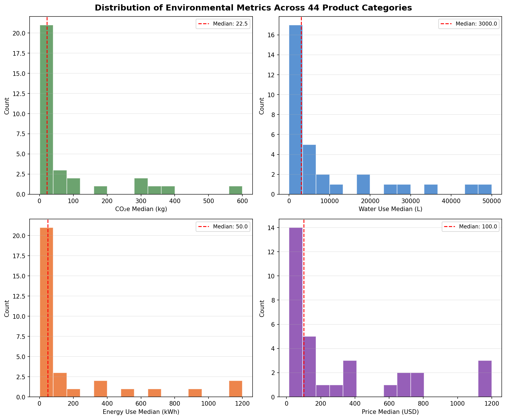
<br><em>Fig 1. Distribution of CO₂e, water, energy, and price across 44 product categories with KDE overlays. Per-subplot statistics include mean, std, and skewness.</em>
</td>
<td width="50%">
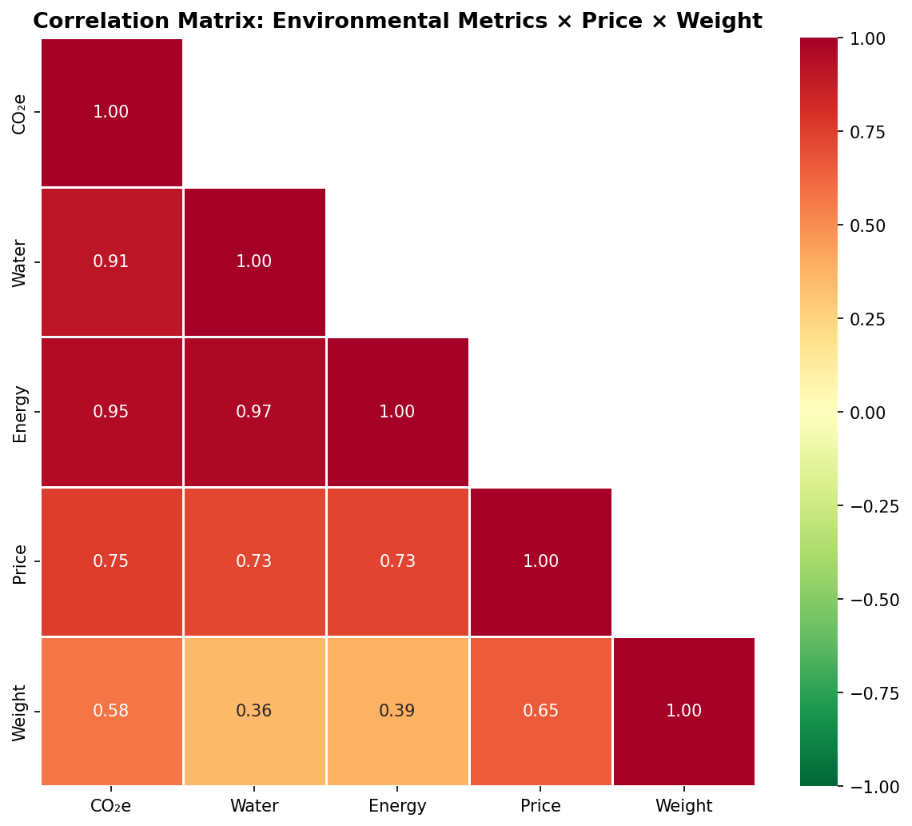
<br><em>Fig 2. Pearson correlation matrix (lower triangle) for five environmental and economic metrics. Significance markers (* p < 0.05, ** p < 0.01) annotated per cell.</em>
</td>
</tr>
<tr>
<td width="50%">
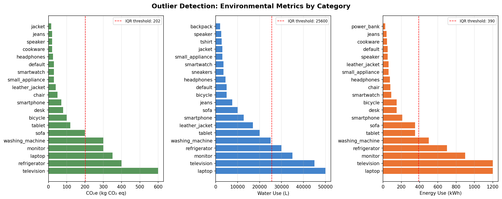
<br><em>Fig 3. Tukey IQR outlier detection (1.5x fence) across CO₂e, water, and energy metrics. Red dashed line marks the upper outlier threshold.</em>
</td>
<td width="50%">
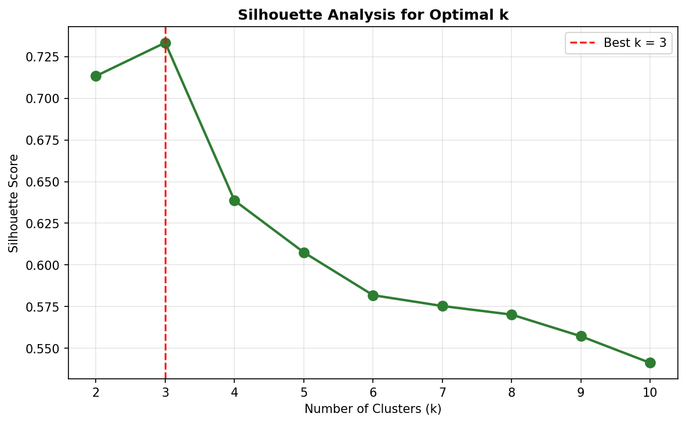
<br><em>Fig 4. Silhouette analysis for optimal cluster count k. Score formula: S(i) = (b - a) / max(a, b) where a is intra-cluster distance and b is nearest-cluster distance.</em>
</td>
</tr>
<tr>
<td width="50%">
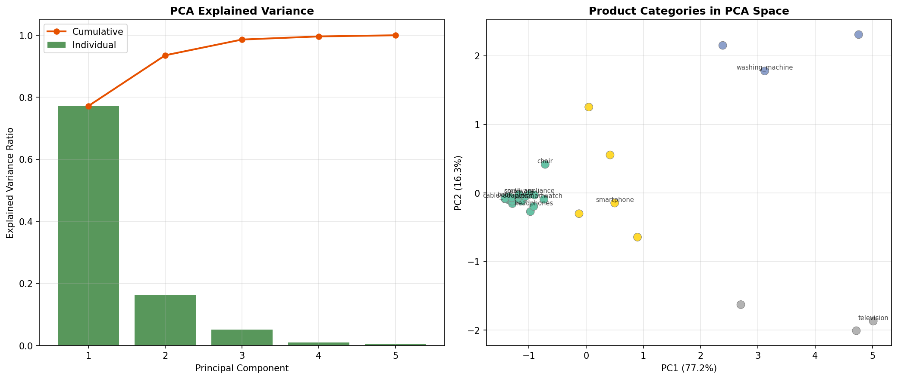
<br><em>Fig 5. PCA explained variance with 80%/95% thresholds (left) and 2D scatter with K-means k = 4 cluster assignments and centroid markers (right).</em>
</td>
<td width="50%">
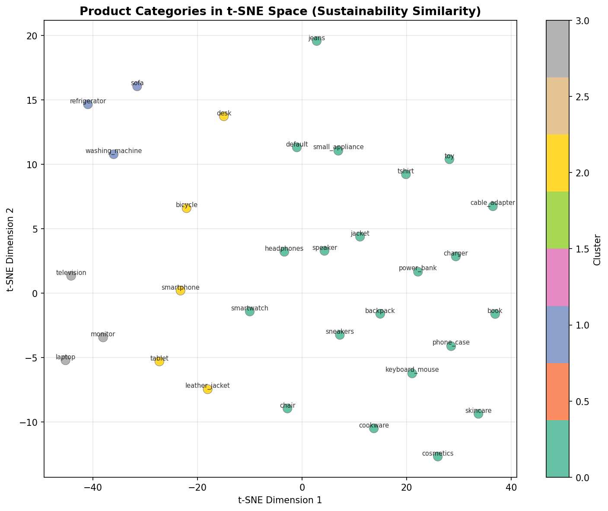
<br><em>Fig 6. t-SNE embedding (Barnes-Hut approximation, perplexity = 15) with K-means cluster assignments and silhouette score annotation.</em>
</td>
</tr>
<tr>
<td width="50%">
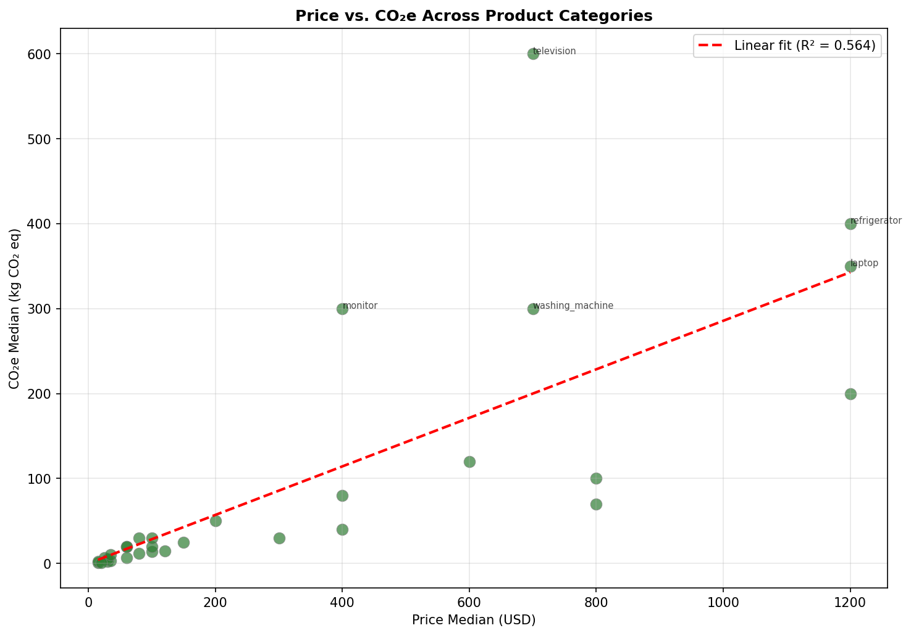
<br><em>Fig 7. OLS linear regression of Price vs. CO₂e with 95% prediction interval band and regression equation overlay.</em>
</td>
<td width="50%">
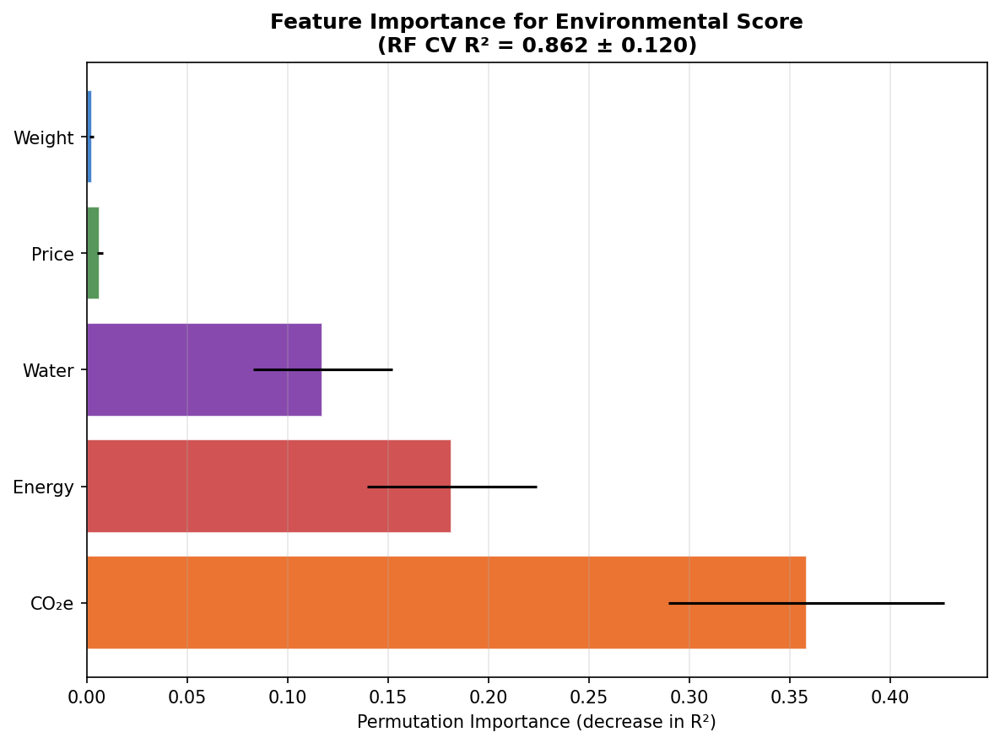
<br><em>Fig 8. Permutation importance (20 repeats) from a Random Forest (n_estimators=100, max_depth=5) with cross-validated R² score.</em>
</td>
</tr>
<tr>
<td width="50%">
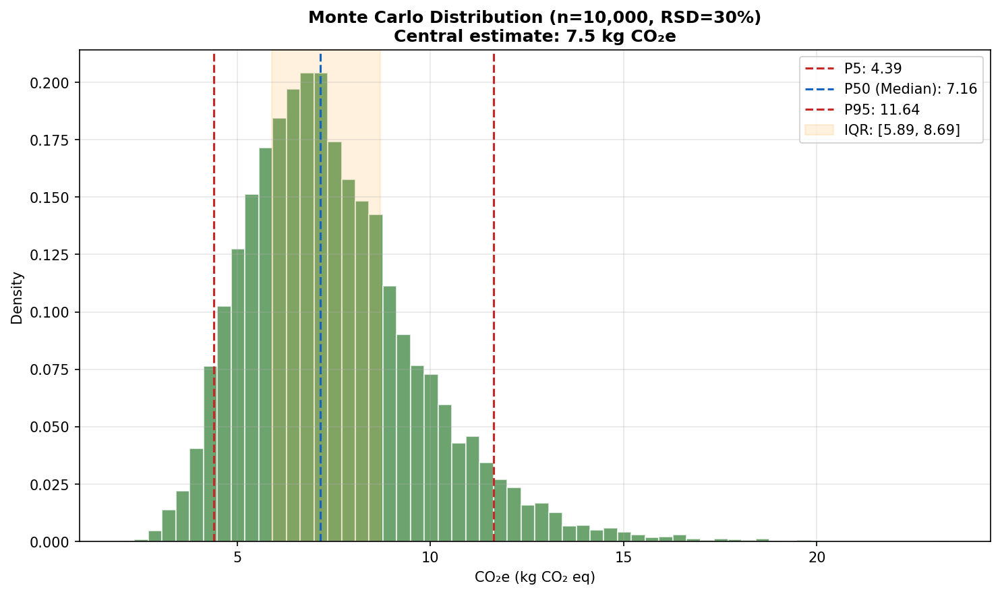
<br><em>Fig 9. Monte Carlo empirical distribution (n = 10,000, lognormal) with P5/P50/P95 percentile lines and IQR shading. Parameters: mu, sigma derived from RSD = 30%.</em>
</td>
<td width="50%">
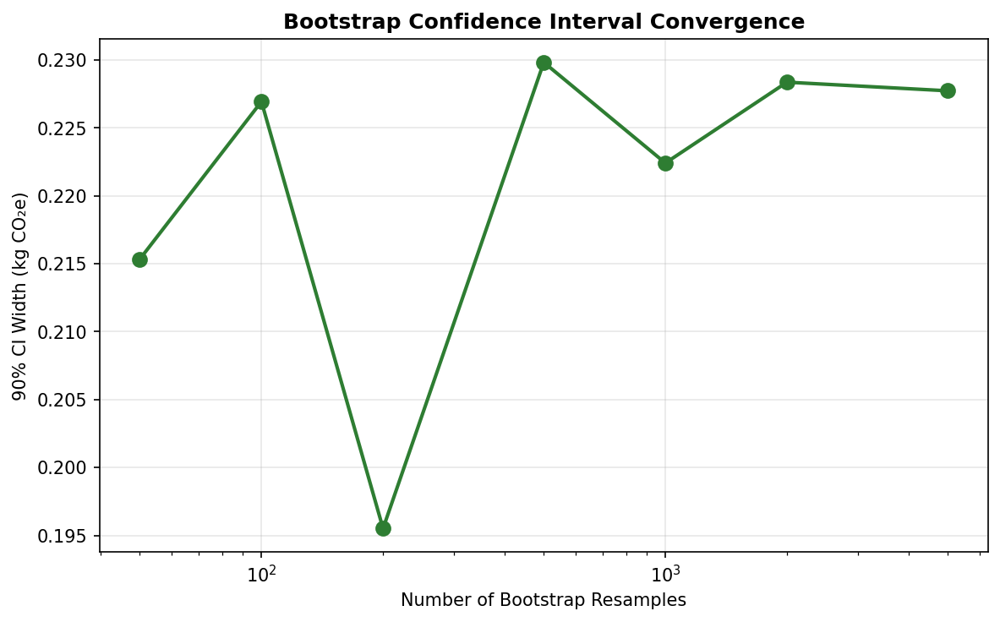
<br><em>Fig 10. Bootstrap CI convergence (90% level) with theoretical 1/sqrt(n) decay curve overlay. CI width decreases from ~50 resamples to 5,000.</em>
</td>
</tr>
<tr>
<td width="50%">
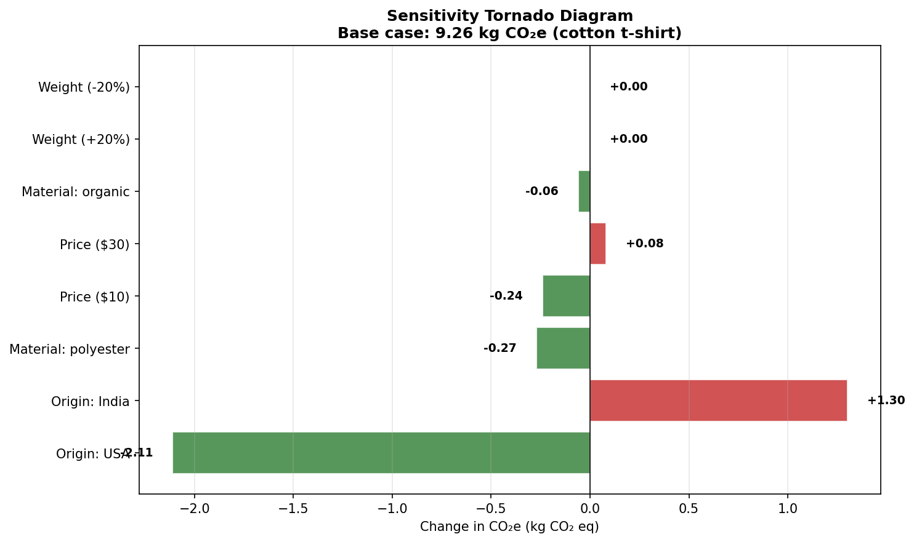
<br><em>Fig 11. OAT sensitivity tornado diagram with absolute deltas (kg CO₂e) and percentage changes. Base case reference line at x = 0.</em>
</td>
<td width="50%">
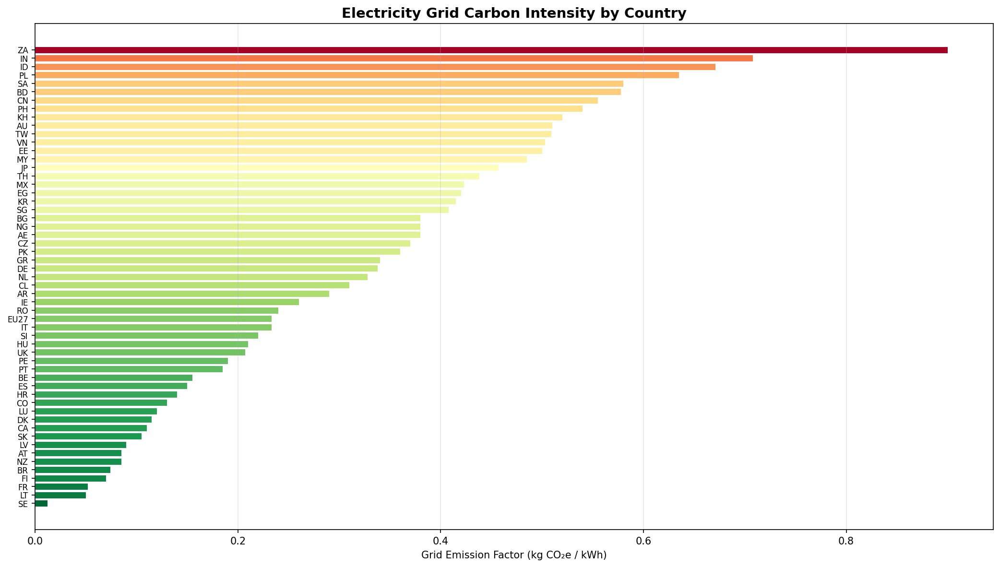
<br><em>Fig 12. Electricity grid carbon intensity by country (scope 2, kg CO₂e/kWh) with global mean reference line and PEF annotation.</em>
</td>
</tr>
<tr>
<td width="50%" colspan="2" align="center">
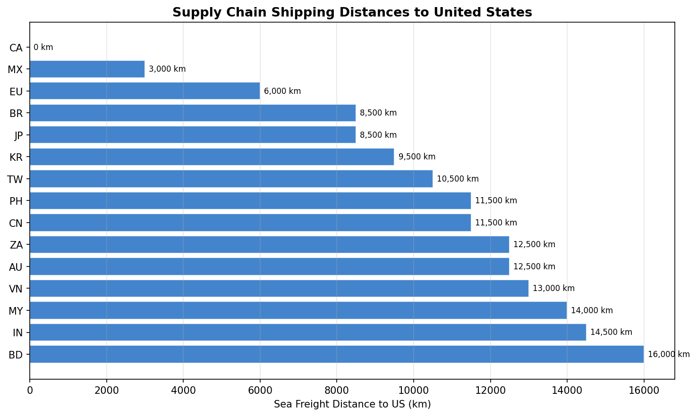
<br><em>Fig 13. Sea freight shipping distances to the United States with estimated transport CO₂e per tonne using DEFRA 2024 container freight factor (0.016 kg CO₂e/tonne-km).</em>
</td>
</tr>
</table>

---

## Methodology

### Life Cycle Assessment Framework

The engine implements a simplified **activity-based LCA** approach:

```
Product Description
    │
    ▼
┌─────────────────────┐
│ Product Classifier   │  Rule-based keyword matching across 44 categories
│ (NAICS + materials)  │  Word-boundary regex, multi-word weighting (0.2/0.4/0.6)
│                      │  Country detection, price extraction, material identification
└─────────┬───────────┘
          │
          ▼
┌─────────────────────┐
│ Impact Calculator    │  Materials: Σ(weight_kg × DEFRA factor per material)
│ (Activity-based)     │  Transport: sea freight (0.016 kg CO₂e/t-km) + domestic truck
│                      │  Energy: benchmark kWh × grid CO₂e factor (country-specific)
│                      │  Water: category benchmark median (liters)
└─────────┬───────────┘
          │
          ▼
┌─────────────────────┐
│ Validator            │  Mass balance check (±30% tolerance)
│                      │  Benchmark range validation (3x warning, 5x hard cap)
│                      │  Confidence assignment (high / medium / low)
└─────────┬───────────┘
          │
          ▼
┌─────────────────────┐
│ Score Engine         │  Normalize to 0-100 per metric (min-max against benchmarks)
│                      │  Weighted overall: 55.58% climate + 22.46% water + 21.96% fossils
│                      │  Letter grade: A+ to F (8 tiers)
│                      │  Percentile ranking via piecewise linear interpolation
└─────────────────────┘
```

### Scoring Formula

For each impact metric, the raw value is normalized against the category benchmark range:

```
score = 100 × (1 − (value − benchmark_min) / (benchmark_max − benchmark_min))
```

The overall score uses a weighted aggregation derived from inverse-variance analysis:

```
overall = 0.5558 × climate_score + 0.2246 × water_score + 0.2196 × fossils_score
```

### Key Constants

| Constant | Value | Source |
|----------|-------|--------|
| **Primary Energy Factor** | 6.48 MJ/kWh (3.6 x 1.8) | Grid loss adjusted conversion |
| **Climate weight** | 55.58% (0.5558) | Inverse-variance derived |
| **Water weight** | 22.46% (0.2246) | Inverse-variance derived |
| **Fossils weight** | 21.96% (0.2196) | Inverse-variance derived |
| **Electronics generic factor** | 5.0 kg CO₂e/kg | Category average for unknown materials |
| **Clothing generic factor** | 2.5 kg CO₂e/kg | Category average for unknown materials |
| **Furniture generic factor** | 3.5 kg CO₂e/kg | Category average for unknown materials |
| **Appliances generic factor** | 4.0 kg CO₂e/kg | Category average for unknown materials |
| **Default fallback factor** | 3.0 kg CO₂e/kg | Cross-category average |
| **Classification threshold** | 0.2 keyword score | Lowered from 0.6 (no feedback loop) |
| **Sea freight factor** | 0.016 kg CO₂e/tonne-km | DEFRA 2024 container freight |
| **Road freight factor** | 0.107 kg CO₂e/tonne-km | DEFRA 2024 average HGV |

### Letter Grade Scale

| Grade | Score Range | Interpretation |
|-------|-------------|----------------|
| **A+** | >= 90 | Excellent environmental performance |
| **A** | 80 to 89 | Very good |
| **B+** | 70 to 79 | Good |
| **B** | 60 to 69 | Above average |
| **C+** | 50 to 59 | Average |
| **C** | 40 to 49 | Below average |
| **D** | 30 to 39 | Poor |
| **F** | < 30 | Very poor environmental performance |

---

## Data Science Techniques

| Technique | Module | Application |
|-----------|--------|-------------|
| **Exploratory Data Analysis** | `analysis/eda.py` | Distribution analysis with **KDE overlays**, **Pearson correlation** matrices, **Tukey IQR** outlier detection |
| **K-Means Clustering** | `analysis/clustering.py` | Product category segmentation by environmental profile with **silhouette analysis** |
| **PCA** | `analysis/clustering.py` | **Dimensionality reduction** of 5-feature sustainability space with explained variance thresholds |
| **t-SNE** | `analysis/clustering.py` | Nonlinear embedding via **Barnes-Hut approximation** for 2D product similarity |
| **Linear Regression** | `analysis/regression.py` | **OLS** fit of Price vs. CO₂e with 95% **prediction intervals** |
| **Random Forest** | `analysis/regression.py` | Material composition to environmental score prediction (n_estimators=100, max_depth=5) |
| **Permutation Importance** | `analysis/regression.py` | Feature importance ranking by decrease in **R-squared** (20 repeats) |
| **Monte Carlo Simulation** | `analysis/uncertainty.py` | **Lognormal** sampling, 10,000 iterations, empirical percentiles (P5/P25/P50/P75/P95) |
| **Bootstrap Confidence Intervals** | `analysis/uncertainty.py` | **Nonparametric** resampling with replacement, 90% CI estimation |
| **OAT Sensitivity Analysis** | `analysis/sensitivity.py` | **One-at-a-time perturbation** (+/-20%), tornado diagram ranking by absolute magnitude |
| **Geospatial Visualization** | `analysis/geospatial.py` | Grid emission intensity bar charts, supply chain shipping distance analysis |

---

## API Documentation

Start the server:

```bash
make api
# or
uvicorn api.main:app --reload --port 8000
```

### Endpoints

| Method | Path | Description |
|--------|------|-------------|
| `POST` | `/api/v1/analyze` | Analyze a product description, returns impacts + scores + validation |
| `GET` | `/api/v1/benchmarks` | List all 44 category benchmarks with min/max/median statistics |
| `GET` | `/api/v1/benchmarks/{category}` | Get detailed benchmark data for a specific category |
| `GET` | `/api/v1/compare?products=a,b,c` | Compare multiple products side by side |
| `GET` | `/api/v1/factors/{type}` | Browse emission factor datasets (materials, transport, electricity, gwp) |

### Example

```bash
curl -X POST http://localhost:8000/api/v1/analyze \
  -H "Content-Type: application/json" \
  -d '{"description": "organic cotton t-shirt 180g made in Bangladesh"}'
```

```json
{
  "product": {
    "product_category": "tshirt",
    "total_weight_kg": 0.18,
    "country_of_origin": "BD",
    "confidence": 0.9
  },
  "impacts": {
    "climate_change_kg_co2e": 7.42,
    "water_use_liters": 2495,
    "energy_use_kwh": 12.5,
    "resource_use_fossils_mj": 81.0
  },
  "scores": {
    "overall": 72,
    "letter_grade": "B+",
    "confidence": "high",
    "percentiles": {
      "overall": 68,
      "category_label": "t-shirts"
    }
  }
}
```

Interactive API docs at [http://localhost:8000/docs](http://localhost:8000/docs).

---

## Interactive Dashboard

```bash
make dashboard
# or
streamlit run streamlit_app.py
```

The **Streamlit** dashboard provides:
- Real-time product analysis with visual score breakdowns
- Interactive **Plotly** charts for score decomposition and radar profiles
- Side-by-side product comparison across all four impact metrics
- Emission factor dataset browser with search and filtering

---

## Repository Structure

```
OpenGreenMetric/
├── openmetric/          # Core LCA engine (Python)
│   ├── classifier.py    # Rule-based keyword classification (44 categories)
│   ├── impact.py        # Activity-based impact calculation (materials + transport + energy)
│   ├── scorer.py        # Multi-criteria scoring (3 weighted sub-scores)
│   ├── validator.py     # Benchmark validation and confidence assignment
│   └── data_loader.py   # Singleton loader for 10 emission factor datasets
├── analysis/            # Data science showcase modules
│   ├── eda.py           # Exploratory data analysis (distributions, correlations, outliers)
│   ├── clustering.py    # K-means, PCA, t-SNE, silhouette analysis
│   ├── regression.py    # OLS regression, Random Forest, permutation importance
│   ├── uncertainty.py   # Monte Carlo simulation, bootstrap confidence intervals
│   ├── sensitivity.py   # OAT perturbation, tornado diagrams
│   └── geospatial.py    # Grid intensity analysis, supply chain distances
├── viz/                 # GIF animation generators (8 scripts)
├── api/                 # FastAPI REST server with Pydantic v2 schemas
├── notebooks/           # 5 Jupyter analysis walkthroughs
├── data/                # 10 emission factor datasets (EPA, DEFRA, IPCC, EU PEF)
├── tests/               # pytest test suite (43 tests)
├── streamlit_app.py     # Interactive Streamlit dashboard
├── animations/          # Generated GIF files (8 animations)
└── figures/             # Generated static figures (13 PNGs)
```

---

## Quick Start

```bash
# Clone the repository
git clone https://github.com/alanknguyen/OpenGreenMetric.git
cd OpenGreenMetric

# Install all dependencies
make install
# or: pip install -e ".[all]"

# Run tests (43 tests)
make test

# Start the API server
make api

# Launch the interactive dashboard
make dashboard

# Generate all GIF animations
make gifs

# Generate all static figures
make figures
```

### Docker

```bash
docker build -t openmetric .
docker run -p 8000:8000 openmetric
```

### Python Library

```python
from openmetric import analyze

result = analyze("Apple iPhone 15 Pro 185g titanium")

print(f"Category: {result.product.product_category}")
print(f"CO2e: {result.impacts.climate_change} kg")
print(f"Score: {result.scores.overall}/100 ({result.scores.letter_grade})")
print(f"Better than {result.scores.percentiles.overall}% of {result.scores.percentiles.category_label}")
```

---

## Datasets

All emission factor datasets are publicly available from their respective agencies:

- **EPA Supply Chain GHG Emission Factors**: [US EPA EEIO](https://www.epa.gov/climateleadership/supply-chain-greenhouse-gas-emission-factors)
- **DEFRA/BEIS Conversion Factors 2024**: [UK Government](https://www.gov.uk/government/collections/government-conversion-factors-for-company-reporting)
- **EPA GHG Emission Factors Hub**: [US EPA](https://www.epa.gov/climateleadership/ghg-emission-factors-hub)
- **IPCC AR6 GWP100**: [IPCC Working Group I](https://www.ipcc.ch/report/ar6/wg1/)
- **EU EF 3.1 Characterization**: [European Platform on LCA](https://eplca.jrc.ec.europa.eu/LCDN/developerEF.xhtml)

---

## Notebooks

| # | Notebook | Topics |
|---|----------|--------|
| 1 | [Data Exploration](notebooks/01_data_exploration.ipynb) | **EDA**, distributions with **KDE**, **Pearson correlations**, **IQR outlier** detection |
| 2 | [Clustering Analysis](notebooks/02_clustering_analysis.ipynb) | **K-means**, **silhouette** analysis, **PCA** variance, **t-SNE** embedding |
| 3 | [Regression Models](notebooks/03_regression_models.ipynb) | **OLS** Price vs. CO₂e, **Random Forest**, **permutation importance** |
| 4 | [Uncertainty Analysis](notebooks/04_uncertainty_analysis.ipynb) | **Monte Carlo** (lognormal), **bootstrap** CIs, sensitivity |
| 5 | [Geospatial Analysis](notebooks/05_geospatial_analysis.ipynb) | Grid carbon intensity, supply chain shipping routes |

---

## License

MIT License. See [LICENSE](LICENSE) for details.
