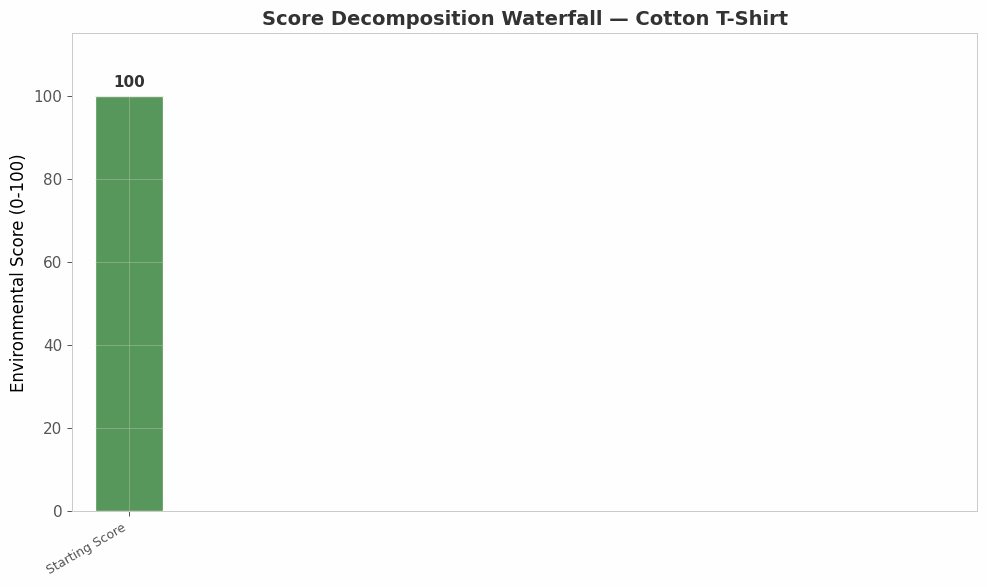
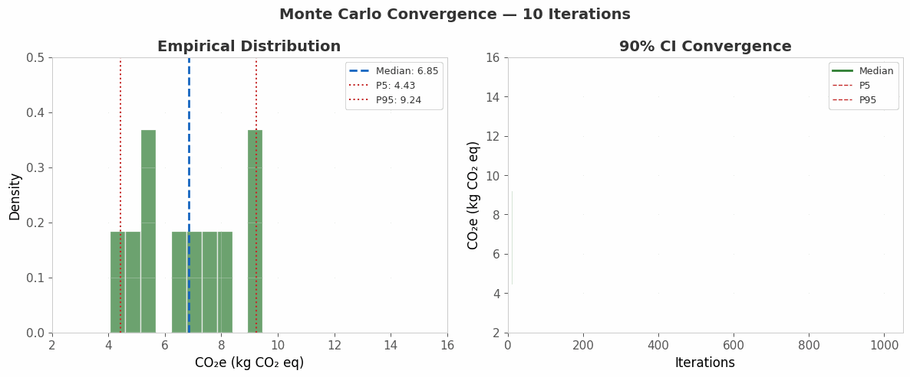
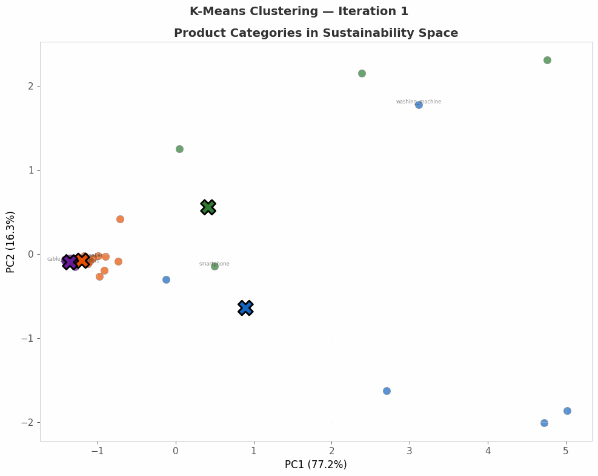
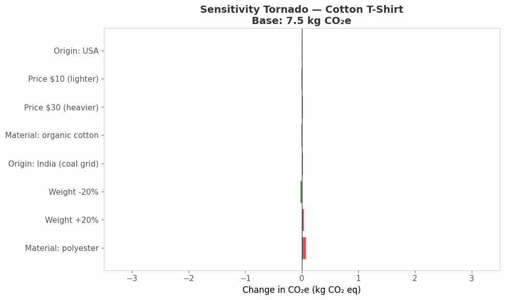
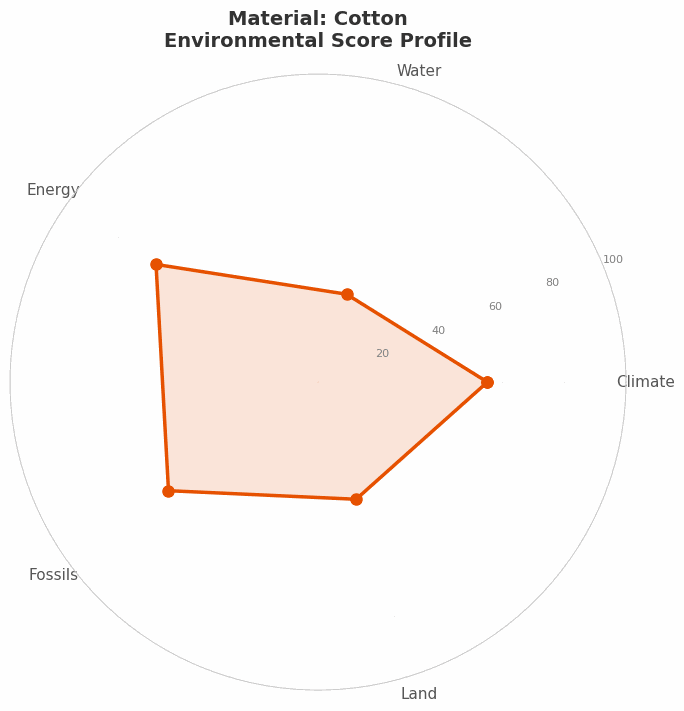
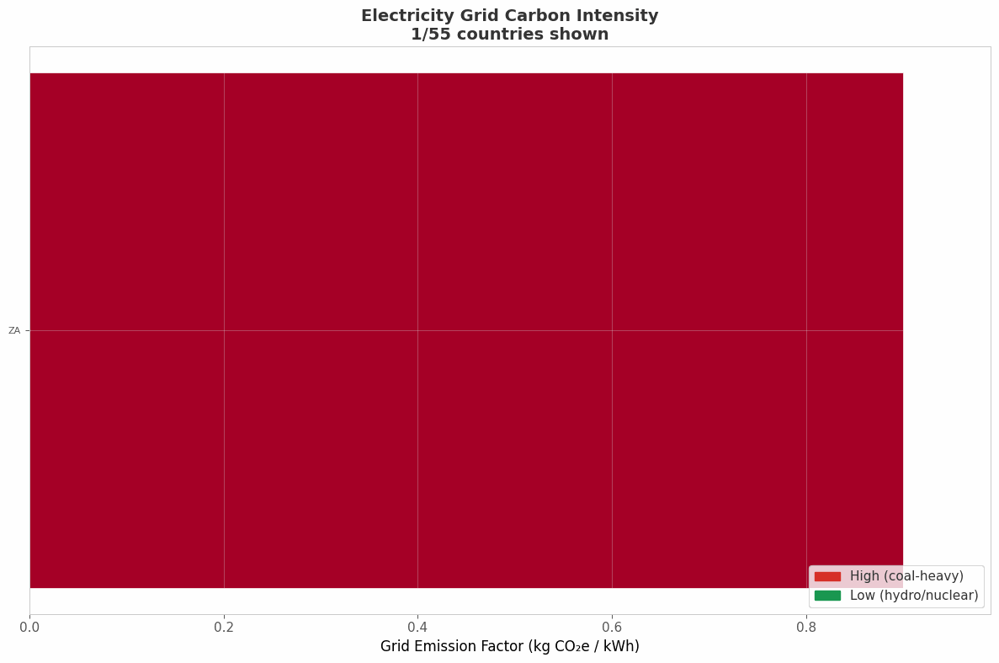
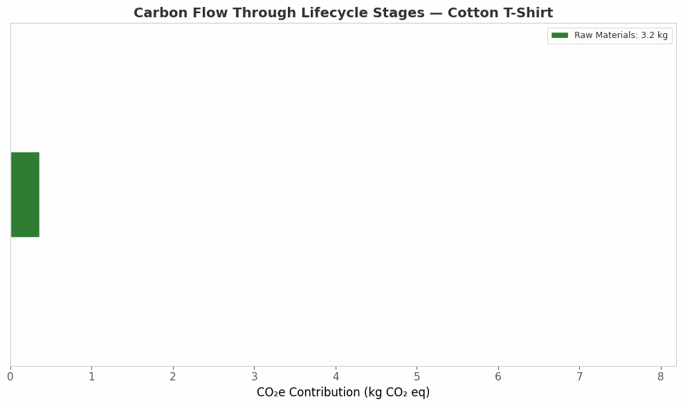
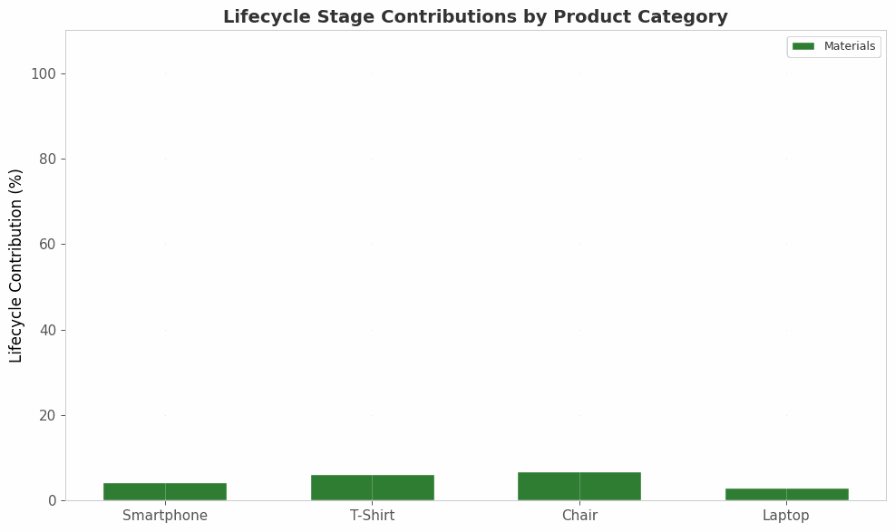

# OpenGreenMetric

## Open-Source Life Cycle Assessment Engine with Data Science Analytics

<p align="center">
  
</p>

[](https://www.python.org/downloads/)
[](https://fastapi.tiangolo.com)
[](https://scikit-learn.org)
[](LICENSE)
[](https://github.com/alanknguyen/OpenGreenMetric/actions)

**Alan Nguyen** | Boston University

---

## Overview

OpenGreenMetric is a quantitative environmental impact assessment engine for consumer products. It analyzes product descriptions and computes CO2 emissions, water consumption, energy use, and fossil resource depletion using **activity-based Life Cycle Assessment (LCA)** methodology with peer-reviewed emission factor databases.

**Key capabilities:**

1. **Rule-based product classification** across 44 consumer product categories
2. **Activity-based impact calculation** (materials + transport + manufacturing energy)
3. **Multi-criteria scoring** with percentile benchmarking against category medians
4. **Monte Carlo uncertainty quantification** with bootstrap confidence intervals
5. **Clustering and dimensionality reduction** of the product sustainability space
6. **Predictive modeling** — price/weight/material composition → environmental impact
7. **Geospatial analysis** of grid emission intensities and supply chain routes
8. **REST API** with professional Pydantic-validated responses

### Data Sources

| Database | Provider | Coverage |
|----------|----------|----------|
| Supply Chain EEIO v1.3 | US EPA | 86 NAICS sectors |
| Conversion Factors 2024 | UK DEFRA/BEIS | 61 materials, 8 transport modes |
| GHG Emission Factors Hub | US EPA | 60+ electricity grids worldwide |
| GWP100 (AR6) | IPCC | 30 greenhouse gases |
| EF 3.1 Characterization | EU PEF | 40+ substances, 16 impact categories |
| Lifecycle Templates | Multiple | 36 product use-phase + EOL profiles |

---

## Animations

### Monte Carlo Convergence

<p align="center">
  
</p>

Watch confidence intervals narrow as the simulation count increases from 10 to 1,000 iterations. The left panel shows the empirical distribution of CO2e estimates building up, while the right panel tracks the 90% confidence interval convergence.

### Product Category Clustering

<p align="center">
  
</p>

44 product categories projected into 2D sustainability space via PCA. K-means centroids converge as clusters of environmentally similar products emerge — electronics (high energy), textiles (high water), furniture (high materials).

### Sensitivity Tornado

<p align="center">
  
</p>

One-at-a-time sensitivity analysis showing which input parameters most influence the final CO2e estimate. Material emission factors and product weight dominate, while transport mode has smaller effect for lightweight products.

### Score Decomposition Waterfall

<p align="center">
  
</p>

Step-by-step decomposition of an environmental score from 100 (perfect) down through material extraction, manufacturing energy, sea transport, domestic distribution, and water use contributions.

### Material Substitution Impact

<p align="center">
  
</p>

Radar chart morphing as materials are substituted in a cotton t-shirt: cotton → organic cotton → recycled polyester → hemp. Each substitution shifts the climate, water, and resource scores.

### Global Grid Intensity

<p align="center">
  
</p>

Countries filling in by electricity grid carbon intensity — from coal-heavy grids (India, South Africa) to near-zero hydro/nuclear grids (Norway, France, Brazil).

### Supply Chain Carbon Flow

<p align="center">
  
</p>

Carbon emissions flowing through lifecycle stages: raw material extraction → manufacturing → international transport → domestic distribution → end of life.

### Lifecycle Stage Evolution

<p align="center">
  
</p>

Stacked area chart showing how manufacturing vs. use-phase vs. end-of-life contributions vary across product categories (smartphone, t-shirt, chair, laptop).

---

## Methodology

### Life Cycle Assessment Framework

The engine implements a simplified **activity-based LCA** approach:

```
Product Description
    │
    ▼
┌─────────────────────┐
│ Product Classifier   │  Rule-based keyword matching → 44 categories
│ (NAICS + materials)  │  Price extraction, weight regression, material detection
└─────────┬───────────┘
          │
          ▼
┌─────────────────────┐
│ Impact Calculator    │  Materials: Σ(weight_kg × DEFRA factor)
│ (Activity-based)     │  Transport: sea freight + domestic truck
│                      │  Energy: benchmark kWh × grid CO2 factor
│                      │  Water: category benchmark median
└─────────┬───────────┘
          │
          ▼
┌─────────────────────┐
│ Validator            │  Mass balance check (±30%)
│                      │  Benchmark range validation (3x warning, 5x cap)
│                      │  Confidence assignment (high/medium/low)
└─────────┬───────────┘
          │
          ▼
┌─────────────────────┐
│ Score Engine         │  Normalize to 0-100 per metric
│                      │  Weighted overall: climate(56%) + water(22%) + fossils(22%)
│                      │  Letter grade: A+ to F
│                      │  Percentile ranking vs. category median
└─────────────────────┘
```

### Scoring Formula

For each impact metric:

```
score = 100 × (1 − (value − benchmark_min) / (benchmark_max − benchmark_min))
```

Overall score uses weighted aggregation:

```
overall = 0.5558 × climate + 0.2246 × water + 0.2196 × resource_fossils
```

---

## Data Science Techniques

| Technique | Module | Application |
|-----------|--------|-------------|
| Exploratory Data Analysis | `analysis/eda.py` | Distribution analysis, correlation matrices, outlier detection |
| K-Means Clustering | `analysis/clustering.py` | Product category segmentation by environmental profile |
| PCA / t-SNE | `analysis/clustering.py` | Dimensionality reduction of 5-feature sustainability space |
| Linear / Polynomial Regression | `analysis/regression.py` | Price → CO2e predictive models per category |
| Random Forest | `analysis/regression.py` | Material composition → environmental score prediction |
| Permutation Importance | `analysis/regression.py` | Feature importance ranking for material drivers |
| Monte Carlo Simulation | `analysis/uncertainty.py` | Lognormal sampling, 1000 iterations, empirical percentiles |
| Bootstrap Confidence Intervals | `analysis/uncertainty.py` | Nonparametric CI estimation |
| Sensitivity Analysis | `analysis/sensitivity.py` | One-at-a-time perturbation, tornado diagrams |
| Geospatial Visualization | `analysis/geospatial.py` | Choropleth maps, great-circle route rendering |

---

## API Documentation

Start the server:

```bash
make api
# or
uvicorn api.main:app --reload --port 8000
```

### Endpoints

| Method | Path | Description |
|--------|------|-------------|
| `POST` | `/api/v1/analyze` | Analyze a product description |
| `GET` | `/api/v1/benchmarks` | List all category benchmarks |
| `GET` | `/api/v1/benchmarks/{category}` | Get specific category data |
| `GET` | `/api/v1/compare?products=a,b,c` | Compare multiple products |
| `GET` | `/api/v1/factors/{type}` | Browse emission factor datasets |

### Example

```bash
curl -X POST http://localhost:8000/api/v1/analyze \
  -H "Content-Type: application/json" \
  -d '{"description": "organic cotton t-shirt 180g made in Bangladesh"}'
```

```json
{
  "product": {
    "product_category": "tshirt",
    "total_weight_kg": 0.18,
    "country_of_origin": "BD",
    "confidence": 0.9
  },
  "impacts": {
    "climate_change_kg_co2e": 7.42,
    "water_use_liters": 2495,
    "energy_use_kwh": 12.5,
    "resource_use_fossils_mj": 81.0
  },
  "scores": {
    "overall": 72,
    "letter_grade": "B+",
    "confidence": "high",
    "percentiles": {
      "overall": 68,
      "category_label": "t-shirts"
    }
  }
}
```

Interactive API docs at [http://localhost:8000/docs](http://localhost:8000/docs).

---

## Interactive Dashboard

```bash
make dashboard
# or
streamlit run streamlit_app.py
```

The Streamlit dashboard provides:
- Real-time product analysis with visual results
- Interactive plotly charts for score decomposition
- Side-by-side product comparison
- Emission factor dataset browser

---

## Repository Structure

```
OpenGreenMetric/
├── openmetric/          # Core LCA engine (Python)
│   ├── classifier.py    # Rule-based product classification
│   ├── impact.py        # Activity-based impact calculation
│   ├── scorer.py        # Multi-criteria scoring
│   ├── validator.py     # Benchmark validation
│   └── data_loader.py   # Emission factor data loader
├── analysis/            # Data science modules
│   ├── eda.py           # Exploratory data analysis
│   ├── clustering.py    # K-means, PCA, t-SNE
│   ├── regression.py    # Predictive models + feature importance
│   ├── uncertainty.py   # Monte Carlo simulation
│   ├── sensitivity.py   # Tornado diagrams
│   └── geospatial.py    # Choropleth maps
├── viz/                 # GIF animation generators
├── api/                 # FastAPI REST server
├── notebooks/           # Jupyter analysis walkthroughs
├── data/                # 10 emission factor datasets (EPA, DEFRA, IPCC)
├── tests/               # pytest test suite
├── streamlit_app.py     # Interactive dashboard
├── animations/          # Generated GIF files
└── figures/             # Generated static figures
```

---

## Quick Start

```bash
# Clone the repository
git clone https://github.com/alanknguyen/OpenGreenMetric.git
cd OpenGreenMetric

# Install all dependencies
make install
# or: pip install -e ".[all]"

# Run tests
make test

# Start the API
make api

# Launch the dashboard
make dashboard

# Generate all GIF animations
make gifs

# Generate all static figures
make figures
```

### Docker

```bash
docker build -t openmetric .
docker run -p 8000:8000 openmetric
```

### Python Library

```python
from openmetric import analyze

result = analyze("Apple iPhone 15 Pro 185g titanium")

print(f"Category: {result.product.product_category}")
print(f"CO2e: {result.impacts.climate_change} kg")
print(f"Score: {result.scores.overall}/100 ({result.scores.letter_grade})")
print(f"Better than {result.scores.percentiles.overall}% of {result.scores.percentiles.category_label}")
```

---

## Datasets

All emission factor datasets are publicly available from their respective agencies:

- **EPA Supply Chain GHG Emission Factors** — [US EPA EEIO](https://www.epa.gov/climateleadership/supply-chain-greenhouse-gas-emission-factors)
- **DEFRA/BEIS Conversion Factors 2024** — [UK Government](https://www.gov.uk/government/collections/government-conversion-factors-for-company-reporting)
- **EPA GHG Emission Factors Hub** — [US EPA](https://www.epa.gov/climateleadership/ghg-emission-factors-hub)
- **IPCC AR6 GWP100** — [IPCC Working Group I](https://www.ipcc.ch/report/ar6/wg1/)
- **EU EF 3.1** — [European Platform on LCA](https://eplca.jrc.ec.europa.eu/LCDN/developerEF.xhtml)

---

## Notebooks

| # | Notebook | Topics |
|---|----------|--------|
| 1 | [Data Exploration](notebooks/01_data_exploration.ipynb) | EDA, distributions, correlations, outlier detection |
| 2 | [Clustering Analysis](notebooks/02_clustering_analysis.ipynb) | K-means, silhouette, PCA, t-SNE |
| 3 | [Regression Models](notebooks/03_regression_models.ipynb) | Price→CO2e, Random Forest, feature importance |
| 4 | [Uncertainty Analysis](notebooks/04_uncertainty_analysis.ipynb) | Monte Carlo, bootstrap CIs, sensitivity |
| 5 | [Geospatial Analysis](notebooks/05_geospatial_analysis.ipynb) | Choropleth maps, supply chain routes |

---

## License

MIT License. See [LICENSE](LICENSE) for details.
